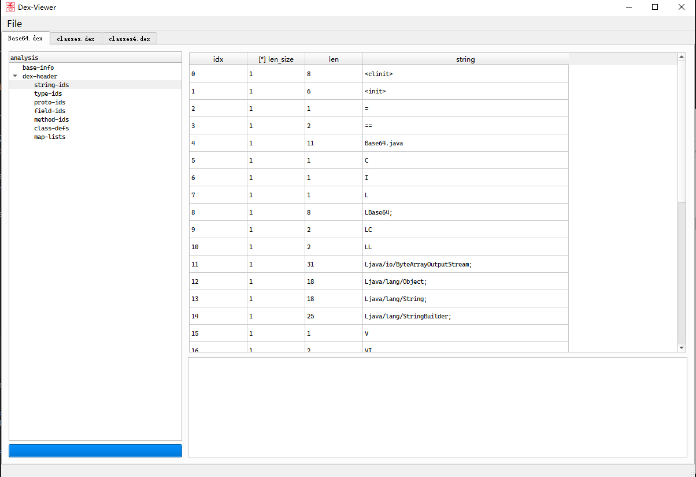

# dex-viewer

tool name	: dex-viewer

description	: a powerful dex file format parser tool , powered by **PyQt5**

writer		: D0g3.21.Reverse.redqx

---


[ feature  && target]

simple and powerful 


[how to work]


```
pip install PyQt5
cd source
python main.py
```


[tool usage] 

click 'Open'in the menu bar or drag the file into the windows


[tool bugs]

1. if there is no response when closing the tab-page, just try again


[to-do-list]

- Complete the first step ✅
- add Hex View ❌
- ...




## Dependency or use follows project code

- Python3

- PyQt5

- [dexparser](https://github.com/bunseokbot/dexparser)
